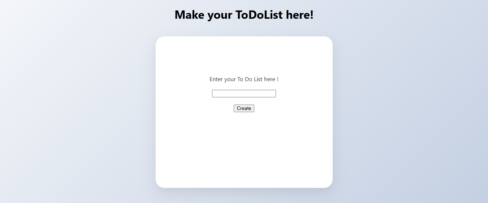
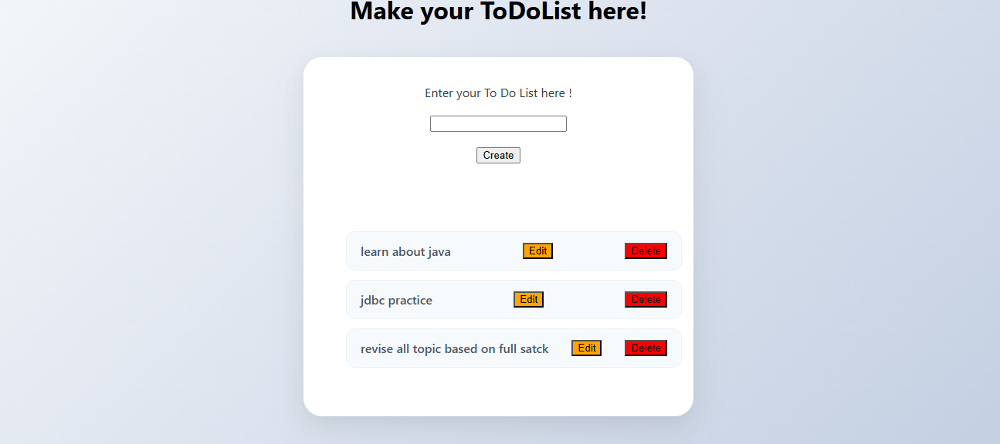

# Todo List App

A responsive Todo List application built using HTML, CSS, and JavaScript.

## Features

- Add new tasks
- Edit existing tasks
- Delete tasks
- Store tasks using Local Storage
- Persistent data after page refresh
- Responsive user interface

## Technologies Used

- HTML5
- CSS3
- JavaScript
- Local Storage API

## Project Structure

```
todo-list-app/
│
├── TDL.html
├── TDL.css
├── TDL.js
├── Screenshots/
└── README.md
```

## How to Run

1. Download the project.
2. Open `index.html` in your browser.
3. Start managing tasks.

## Screenshots

### Home Page



### Task Added


### Task Updated



## Future Improvements

- Task categories
- Due dates
- Dark mode
- Search functionality
- Task priority levels